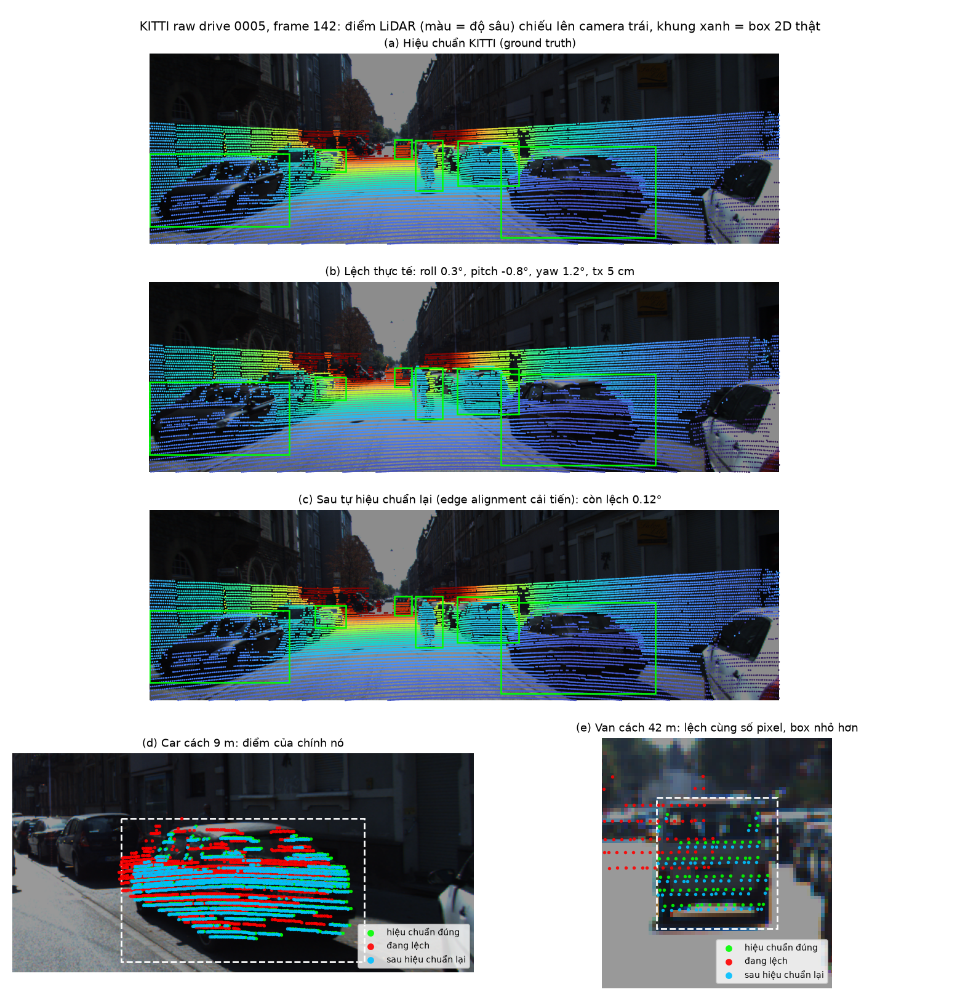
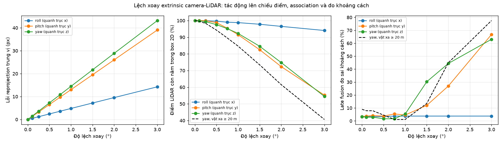
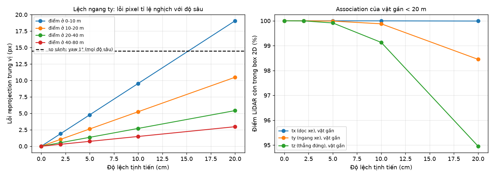
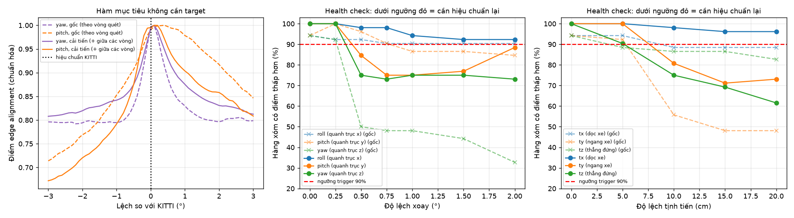

# T3 — Lệch hiệu chuẩn camera–LiDAR trên xe ADAS

**Lệnh chạy:** `python run_benchmark.py` — 74.8 s trên CPU laptop (Python 3.13.14, numpy 2.2.6, không GPU).
**Kiểm định:** `python validate_holdout.py --drives 0048 0005 --label dev` (162.8 s) và `python validate_holdout.py --drives 0052 --label holdout` (135.6 s).
**Dữ liệu:** KITTI raw 2011_09_26, drive 0048 (22 frame) và drive 0005 (154 frame); dùng mỗi frame thứ 2 → 11 + 77 = 88 frame. Đây là drive dev.
Drive 0052 (78 frame, dùng 39) chỉ dùng để kiểm định, không dùng để tinh chỉnh.
Mọi con số dưới đây lấy từ `results/` và `results/holdout/` của các lần chạy này.

## 1. Problem — vấn đề

- **Nền tảng:** xe ADAS.
- **Cảm biến:** camera màu phía trước (cam 2) và LiDAR Velodyne HDL-64E trên nóc.

Muốn ghép hai cảm biến, xe phải biết LiDAR đặt xoay và lệch so với camera bao nhiêu.
Bộ số đó là **tham số ngoài (extrinsic)**.
Sau rung lắc lâu ngày, hoặc một cú va vào giá đỡ, bộ số này lệch đi.
Từng cảm biến vẫn trông bình thường: ảnh vẫn nét, đám mây điểm vẫn đúng hình.
Nhưng khi ghép, điểm LiDAR rơi sai chỗ trên ảnh, nên khung 2D của camera lấy nhầm độ sâu.
Không cảm biến nào tự báo lỗi. Đó là **lệch hiệu chuẩn (calibration drift)**.

Câu hỏi: lệch bao nhiêu thì ghép hỏng, hướng nào nguy hiểm nhất, và có tự phát hiện được không khi không có bảng hiệu chuẩn?

## 2. Method — cách làm

Trục là trục của LiDAR: x hướng tới trước, y sang trái, z lên trên. Roll xoay quanh x, pitch quanh y, yaw quanh z.
Hiệu chuẩn gốc của KITTI được coi là đáp án đúng (ground truth).

**(1) Quét độ lệch.** Cố ý làm lệch extrinsic từng trục một: roll / pitch / yaw 0–3°, tx / ty / tz 0–20 cm. Đo ba thứ:

| Chỉ số | Ý nghĩa |
|---|---|
| Lỗi chiếu điểm (reprojection error, px) | điểm LiDAR dời bao nhiêu pixel so với khi đúng; lấy trung vị theo dải độ sâu |
| Tỉ lệ giữ điểm (association retention, %) | phần điểm LiDAR của chính vật còn nằm trong box 2D thật của nó. Box 2D là box 3D tracklet chiếu lên ảnh, tức là một bộ phát hiện 2D hoàn hảo |
| Đo sai khoảng cách (late-fusion range miss, %) | lấy trung vị độ sâu LiDAR ở nửa giữa box, so với độ sâu thật; sai nếu lệch > max(1 m, 10 %) hoặc không còn điểm |

**(2) Tự kiểm tra sức khỏe, không cần bảng (targetless monitor)**, theo Levinson & Thrun (RSS 2013).
Chỗ LiDAR thấy độ sâu nhảy đột ngột (mép xe, cột, tường) thường trùng với một cạnh trong ảnh.
Điểm số = độ mạnh cạnh ảnh tại các điểm "mép" LiDAR sau khi chiếu, lấy trung bình có trọng số.
Nếu extrinsic đang đúng, mọi phương án lệch nhỏ quanh nó đều có điểm thấp hơn.
**Health** = phần trăm trong 52 phương án hàng xóm có điểm thấp hơn (lưới xoay 3×3×3 bước 0.5° và lưới dịch 3×3×3 bước 10 cm).
Health < 90 % → đề nghị hiệu chuẩn lại. Monitor gộp 24 frame.

**(3) Tự chỉnh lại góc xoay** bằng tìm theo lưới từng trục (coordinate grid search): yaw → pitch → roll, lưới 0.1° trong ±3°, rồi 0.02° trong ±0.3°. Không chỉnh phần tịnh tiến.

**Hai thay đổi của nhóm so với paper:**

- *Quầng cạnh ảnh hẹp hơn:* hệ số suy giảm 0.8 trên 15 px thay vì 0.98. Với 0.98, điểm số gần như phẳng trên ảnh KITTI và đỉnh yaw trôi tới +3°.
- *Tìm độ sâu nhảy cả giữa hai vòng quét kề nhau*, không chỉ dọc mỗi vòng. Bản này gọi là "improved". Nó thấy cả mép ngang như nóc xe, nên giữ pitch tốt hơn trên drive dev. Trên drive kiểm định 0052, bản này lại có một đỉnh giả roll–pitch mà bản paper không có (mục 4).

**Kiểm định:** hai thiết lập trên được chỉnh trên chính 0048 và 0005. Vì vậy nhóm chấm lại cả hai bản trên drive 0052, giữ nguyên mọi thiết lập (mục 3).
Vẫn còn hạn chế: chỉ có một drive kiểm định và 20 độ lệch ngẫu nhiên. Một ca chênh nhau đã là 5 điểm phần trăm.

## 3. Benchmark — kết quả

88 frame, 241 lượt vật thể (Car 88, Van 84, Cyclist 66, Pedestrian 3). Khoảng cách trung vị 17.0 m; 152 vật gần (< 20 m), 89 vật xa. Tiêu cự 721.5 px.

**Lệch xoay** (`rotation_sweep.csv`). Khi không lệch, cách đo khoảng cách vẫn sai 3.3 % (toàn vật xa). Đó là mức nền.

| Lệch | Lỗi chiếu (px) | Giữ điểm (%) | Giữ điểm, vật xa (%) | Sai khoảng cách (%) | Sai k/c, vật gần (%) | Sai k/c, vật xa (%) |
|---|---|---|---|---|---|---|
| không lệch | 0.0 | 100.0 | 100.0 | 3.3 | 0.0 | 9.0 |
| yaw 0.5° | 7.2 | 97.6 | 94.3 | 1.7 | 0.0 | 4.5 |
| yaw 1° | 14.5 | 92.3 | 84.7 | 5.4 | 7.9 | 1.1 |
| yaw 2° | 28.9 | 74.8 | 61.5 | 44.4 | 44.1 | 44.9 |
| pitch 0.5° | 6.5 | 98.7 | 96.6 | 3.7 | 0.0 | 10.1 |
| pitch 1° | 13.0 | 91.5 | 78.1 | 4.6 | 0.0 | 12.4 |
| pitch 2° | 26.0 | 72.3 | 41.2 | 27.0 | 7.2 | 60.7 |
| roll 0.5° | 2.4 | 99.6 | 99.1 | 3.3 | 0.0 | 9.0 |
| roll 1° | 4.8 | 98.8 | 97.3 | 3.7 | 0.7 | 9.0 |
| roll 2° | 9.5 | 96.5 | 93.4 | 3.7 | 0.7 | 9.0 |

**Dịch so với xoay** — lỗi chiếu trung vị (px) theo độ sâu (`translation_sweep.csv`, `rotation_sweep.csv`):

| Lệch | 0–10 m | 10–20 m | 20–40 m | 40–80 m |
|---|---|---|---|---|
| ty 10 cm (ngang) | 9.5 | 5.2 | 2.7 | 1.5 |
| tz 10 cm (đứng) | 9.6 | 5.3 | 2.7 | 1.5 |
| tx 10 cm (dọc xe) | 4.4 | 1.9 | 0.8 | 0.3 |
| yaw 1° | 15.2 | 14.5 | 13.7 | 13.2 |
| pitch 1° | 13.6 | 13.0 | 12.7 | 12.7 |

Dịch tới 20 cm chỉ đẩy tỉ lệ đo sai khoảng cách từ 3.3 % lên 4.1 % (cả ba trục).

**Monitor phát hiện từ mức nào** (`monitor_sweep.csv`; mức lệch nhỏ nhất làm health < 90 %):

| Trục | Paper (chỉ dọc vòng quét) | Improved (+ giữa các vòng) |
|---|---|---|
| không lệch | 94.2 % → không báo | 100.0 % → không báo |
| roll | không phát hiện tới 2° (thấp nhất 90.4 %) | không phát hiện tới 2° (thấp nhất 92.3 %) |
| pitch | ≥ 1° | ≥ 0.5° |
| yaw | ≥ 0.5° | ≥ 0.5° |
| tx | ≥ 10 cm | không phát hiện tới 20 cm (thấp nhất 96.2 %) |
| ty | ≥ 10 cm | ≥ 10 cm |
| tz | ≥ 5 cm | ≥ 10 cm |

Trên drive dev, đỉnh điểm số của bản paper nằm cách hiệu chuẩn KITTI 0.50°, của bản improved 0.15°. Trên 0052 hai bản ngang nhau: 0.18° và 0.21°.

**Một ca lệch thực tế trên drive dev** (một cú va: roll 0.3°, pitch −0.8°, yaw 1.2°, tx 5 cm; `refinement.json`; health do monitor improved chấm).
Đây là một ca duy nhất, trên dữ liệu đã dùng để tinh chỉnh. Không lấy nó làm mức chung; mức chung ở bảng kiểm định bên dưới.

| | Đang lệch | Chỉnh bằng bản paper | Chỉnh bằng bản improved |
|---|---|---|---|
| Sai số xoay còn lại (°) | 1.47 | 0.52 | 0.12 |
| roll / pitch / yaw còn lại (°) | 0.30 / −0.80 / 1.20 | 0.18 / 0.49 / 0.07 | 0.02 / 0.11 / 0.04 |
| Sai số dịch còn lại (cm) | 5.0 | 5.0 | 5.0 |
| Health | 44.2 % → báo | 86.5 % → báo | 100.0 % → không báo |
| Lỗi chiếu trung vị (px) | 20.7 | 6.1 | 1.5 |
| Giữ điểm / vật xa (%) | 82.7 / 69.0 | 99.0 / 97.4 | 100.0 / 99.9 |
| Vật mất hẳn (%) | 6.2 | 0.0 | 0.0 |
| Sai khoảng cách (%) | 23.7 | 3.3 | 3.3 |

(Góc ở bảng này ghi 2 chữ số thập phân như trong log, vì 1 chữ số sẽ làm mất phần dư nhỏ.)

### Kiểm định trên drive chưa dùng để tinh chỉnh (0052)

Drive 2011_09_26_drive_0052: 78 frame, dùng 39, monitor gộp 24. Xe đi chậm; hai bên đường có ô tô và xe van đỗ.
Drive này chưa từng dùng để chỉnh tham số. Thiết lập giữ nguyên, không chỉnh thêm.
Cùng kịch bản chạy lại trên drive dev (0048 + 0005) để so sánh: 20 độ lệch ngẫu nhiên, seed 7. Roll, pitch, yaw mỗi trục lấy đều trong ±1.5°; tx, ty, tz mỗi trục trong ±5 cm. Trung vị độ lệch xoay đưa vào là 1.50°.
Nguồn: `results/holdout/dev_summary.json`, `holdout_summary.json`, `dev_random_drifts.csv`, `holdout_random_drifts.csv`.

| Chỉ số | Dev, paper | Dev, improved | 0052, paper | 0052, improved |
|---|---|---|---|---|
| Báo nhầm khi hiệu chuẩn đúng | không | không | không | không |
| Bắt được lệch ngẫu nhiên (/20) | 85 % | 90 % | 95 % | 90 % |
| Sai số xoay còn lại sau khi chỉnh, trung vị | 0.61° | 0.29° | 0.55° | 0.44° |
| Sai số xoay còn lại, phân vị 90 | 0.83° | 0.37° | 0.70° | **1.75°** |
| Số ca chỉnh hỏng (còn > 1°) | 0 | 0 | 0 | **3** (2.19°, 1.84°, 1.74°) |
| Đỉnh điểm số cách KITTI | 0.50° | 0.15° | 0.18° | 0.21° |
| Ca 14 (1.24°, 3 cm; phần lớn là roll 1.15°) | không bắt | không bắt | không bắt | không bắt |

Trên drive mới, cả hai bản đều không báo nhầm và vẫn bắt 90–95 % độ lệch.
Bản improved vẫn tốt hơn ở trung vị (0.44° so với 0.55°) nhưng kém tin cậy hơn: 3/20 ca chỉnh hỏng, nên phân vị 90 lên 1.75° so với 0.70°.
Cả ba ca đều bắt đầu với roll ≈ −1.4° và pitch ≈ +1°, và roll, pitch gần như không đổi sau khi chỉnh: bộ chỉnh dừng ở một đỉnh giả nơi roll và pitch bù trừ nhau (mục 4).
Ưu thế về vị trí đỉnh điểm số trên dev (0.15° so với 0.50°) không lặp lại trên 0052.

**Kết luận từ paper** (Levinson & Thrun 2013, trên dữ liệu riêng của họ, không phải KITTI): phát hiện lệch trong vòng một giây khi lỗi vượt 0.25° hoặc 10 cm, chính xác 100 %; theo dõi lệch xoay với sai số trung bình 0.10°.
DF-Calib báo cáo trên KITTI sai số 0.045° xoay và 0.635 cm dịch. Nhóm không chạy lại các con số này.

**Kết luận nhóm tự benchmark** (KITTI, 88 frame dev và 39 frame kiểm định của 0052; monitor gộp 24 frame):

1. **Xoay mới là thứ đáng sợ.** Yaw 1° làm điểm dời 14.5 px ở mọi độ sâu. Dịch ngang 10 cm chỉ dời 9.5 px trong 10 m đầu và 2.7 px ở 20–40 m.
2. **Mốc nguy hiểm khoảng 1°.** Tới 1°, vật xa còn giữ 78.1–84.7 % điểm. Từ 1.5°, đo sai khoảng cách lên 12.0 % (pitch) và 30.3 % (yaw).
3. **Pitch làm hỏng việc ghép điểm vào box nặng hơn yaw**, dù dời ít pixel hơn (26.0 so với 28.9 px ở 2°), vì vật thường rộng hơn cao. Ở 2°, vật xa còn 41.2 % điểm với pitch, 61.5 % với yaw. Riêng khoảng cách của vật gần thì yaw hại hơn (44.1 % so với 7.2 % ở 2°).
4. **Vật xa hỏng trước.** Box nhỏ hơn mà điểm vẫn dời cùng số pixel.
5. **Monitor improved**, trên drive dev, bắt được yaw và pitch từ 0.5°, ty và tz từ 10 cm. Nó không bắt được roll tới 2° và tx tới 20 cm. Nhóm **không** đạt mức 0.25° của paper trên KITTI.
6. **Tự chỉnh xoay**, trên một ca lệch thực tế của drive dev, đưa 1.47° về 0.12° (bản improved), lỗi chiếu từ 20.7 px về 1.5 px, đo sai khoảng cách về đúng mức nền 3.3 %. Đây là một ca, không phải mức chung.
7. **Trên drive kiểm định 0052, bản improved không tốt hơn rõ ràng.** Không bản nào báo nhầm; bản paper bắt 95 %, bản improved 90 % trong 20 độ lệch ngẫu nhiên. Bản improved tốt hơn trên drive dev và ở trung vị trên 0052 (0.44° so với 0.55°). Nhưng nó kém tin cậy hơn: 3/20 ca chỉnh hỏng vì đỉnh giả roll–pitch, phân vị 90 là 1.75° so với 0.70° của bản paper.

## 4. Failure case — trường hợp hỏng

**Ca chính: lệch roll không bao giờ bị phát hiện, tới 2°, ở cả hai bản monitor.**

- *Hiện tượng:* trên drive dev, ở roll 2°, health vẫn 90.4 % (paper) và 92.3 % (improved), trên ngưỡng 90 %. Trên 0052, bản improved báo ở roll 2° (88.5 %), bản paper vẫn không (94.2 %). Ca ngẫu nhiên 14 (phần lớn là roll 1.15°) không bị bản nào bắt, trên cả hai bộ dữ liệu.
- *Vì sao:* roll làm ảnh xoay quanh trục nhìn của camera. Điểm gần tâm ảnh gần như đứng yên; chỉ điểm ở hai mép trái phải mới dời. Ở roll 2°, trung vị chỉ 9.5 px nhưng 5 % điểm dời nhiều nhất đã tới 20.2 px. Phần lớn điểm "mép" nằm giữa ảnh, nên điểm số gần như không đổi.
- *Tác động:* cũng nhỏ nhất. Roll 2° vẫn giữ 96.5 % điểm (vật xa 93.4 %); sai khoảng cách 3.7 %, sát mức nền 3.3 %. Nhưng ở 3°, vật xa chỉ còn 88.7 %. Vật ở mép ảnh, như xe cắt làn hay người đứng lề đường, chịu nhiều nhất.
- *Kết luận:* monitor này mù với roll. Lỗi roll tích lũy chậm sẽ không bị báo cho tới khi đã đủ lớn.

**Ca thứ hai: đỉnh giả roll–pitch trên drive kiểm định 0052 (bản improved).**
Ca này nặng hơn ca roll ở trên. Nó đo được trên dữ liệu chưa dùng để tinh chỉnh, và bộ chỉnh trả về extrinsic gần như sai như lúc chưa chỉnh.

| Ca | Lệch đưa vào: roll / pitch / yaw (°) | Tổng | Paper còn lại | Improved còn lại | Improved: roll / pitch còn lại (°) |
|---|---|---|---|---|---|
| 1 | −1.48 / 0.96 / 0.89 | 1.99° | 0.44° | 2.19° | −1.87 / 0.96 |
| 19 | −1.48 / 0.76 / 0.93 | 1.91° | 0.51° | 1.84° | −1.39 / 1.09 |
| 15 | −1.39 / 1.13 / −0.10 | 1.79° | 0.75° | 1.74° | −1.21 / 1.10 |

- *Hiện tượng:* monitor improved báo đúng cả ba ca (health 76.9 %, 46.2 %, 59.6 %). Nhưng sau khi chỉnh, roll và pitch gần như giữ nguyên. Bản paper đưa cả ba về 0.44–0.75°.
- *Vì sao:* bộ chỉnh tìm theo từng trục. Nó dừng ở một đỉnh giả nơi roll và pitch bù trừ nhau: đổi riêng một trục thì điểm số giảm, nên không thoát ra được. Bản paper không có cạnh ngang nên không có đỉnh giả này.
- *Liên hệ với quầng cạnh:* quầng cạnh ảnh rộng 15 px, tức khoảng 1.2° ở tiêu cự 721.5 px. Lệch lớn hơn quầng thì điểm "mép" rơi ra ngoài vùng quầng của cạnh đúng, và điểm số gần như phẳng (như đường yaw ngoài ±1.5° ở hình 04). Ba ca trên lệch tổng 1.79–1.99°, vượt quầng. Đây là đánh đổi: quầng hẹp cho đỉnh chính xác (0.15–0.21°); quầng rộng cho vùng bắt rộng, nhưng đỉnh trôi (decay 0.98 đẩy đỉnh yaw tới +3°).
- *Cách sửa đề xuất (chưa làm):* tìm thô đến tinh (coarse-to-fine), tức là quầng rộng trước để kéo về gần, rồi quầng hẹp để chốt chính xác. Thêm ràng buộc mặt đường cho roll và pitch như Galibr: mặt đường trong LiDAR cho roll và pitch mà không cần cạnh ảnh.

**Các ca hỏng khác (ngắn):**

- *Dịch dọc tx:* bản improved không bắt được tới 20 cm (96.2 %), bản paper bắt từ 10 cm (88.5 %). Trên drive dev, đây là đánh đổi: thêm độ nhạy pitch thì mất độ nhạy tx. Trên 0052, cả hai bản đều không bắt tx tới 20 cm (98.1 %). Bù lại tx 20 cm hại ít: 8.7 px trong 10 m, 1.5 px ở 20–40 m, sai khoảng cách 4.1 %.
- *Hàm điểm số không lồi toàn cục:* ở hình 04 (bên trái), ngoài ±1.5° đường yaw phẳng và gợn nhẹ. Sau một cú lệch lớn đột ngột, bộ chỉnh tìm cục bộ có thể bám vào một đỉnh giả. Code dùng lưới đầy đủ ±3° chính vì vậy; lệch quá 3° thì vẫn hỏng. Ca thứ hai ở trên là ví dụ đo được của chuyện này trên 0052.
- *Không chỉnh tịnh tiến:* 5 cm vẫn còn nguyên sau khi chỉnh. Riêng tx 5 cm đã gây 1.1 px trung vị (2.2 px trong 10 m), là phần lớn của 1.5 px còn lại.

## 5. Engineering decision — quyết định kỹ thuật

**Ghi log gì:** theo từng drive, kèm thời gian: health, điểm số, mức cải thiện của hàng xóm tốt nhất, số điểm "mép" LiDAR trong khung nhìn, mật độ cạnh ảnh, độ lệch xoay mà bộ chỉnh ước lượng, tốc độ xe, sự kiện xóc từ IMU.

**Luật kích hoạt:**

| Điều kiện | Hành động |
|---|---|
| health < 90 % trên một cửa sổ frame (như 24 frame trong thử nghiệm) | giảm trọng số ghép camera–LiDAR, nới cổng ghép box–điểm, lên lịch hiệu chuẩn lại |
| độ lệch ước lượng > ~1° | xếp mức **S2 — suy giảm (degraded)** theo thang S0–S3 của bài giảng; 1° là mốc vật xa bắt đầu mất điểm, từ 1.5° đo khoảng cách sai mạnh |
| sau khi tự chỉnh, health trên cửa sổ tiếp theo ≥ 90 % | mới dùng extrinsic mới; nếu không, giữ chế độ dự phòng |

**Dự phòng khi luật kích hoạt:** lấy khoảng cách từ LiDAR thuần (box 3D), lấy loại vật từ camera thuần, không ghép điểm vào box 2D. Báo người lái và tăng khoảng cách an toàn.

**Thu thêm dữ liệu:** lưu ảnh và scan quanh mỗi lần kích hoạt; ghi lại đường xấu, ổ gà, cú va; mỗi lần bảo dưỡng đo lại bằng bảng hiệu chuẩn để có đáp án thật cho độ lệch.

**Khi KHÔNG dùng phương pháp này:**

- Cảnh ít cạnh: cao tốc ban đêm, đồng trống.
- Mưa, lóa nắng, sương: cạnh ảnh mất hoặc sinh cạnh giả.
- Cần bắt lệch roll hoặc lệch dịch: monitor gần như mù.
- Lệch lớn đột ngột trên 3°: ngoài vùng tìm.
- Lệch roll và pitch cùng lúc, lớn hơn quầng cạnh (~1.2°): bản improved có thể bám đỉnh giả (mục 4).
- Hiệu chuẩn ban đầu ở xưởng: vẫn cần bảng hoặc cách chính xác hơn.

**Đánh đổi theo nền tảng:**

| Nền tảng | Có nên dùng? | Lý do |
|---|---|---|
| Xe ADAS trong phố | Có, làm monitor rẻ | nhiều cạnh; lệch xoay do rung là mối nguy chính; chạy được trên CPU |
| Robot trong nhà, tầm gần | Hạn chế | vật trong 10 m: dịch 10 cm đã gây 9.5 px, mà cách này không chỉnh dịch |
| Drone | Không nên dùng một mình | nhìn xuống mặt đất nên ít độ sâu nhảy; rung mạnh nên lệch nhanh |

**Làm tiếp:** thêm ràng buộc mặt đường như Galibr để giữ pitch, roll và độ cao; thử bộ phát hiện học máy (Cal or No Cal, DF-Calib) nhưng tránh các drive đã nằm trong tập train; dùng nhiều frame hơn; tìm thô đến tinh (quầng rộng rồi hẹp); kiểm định trên nhiều drive hơn 0052 và nhiều hơn 20 độ lệch ngẫu nhiên.

## Nguồn

- J. Levinson, S. Thrun, "Automatic Online Calibration of Cameras and Lasers", RSS 2013 — https://www.roboticsproceedings.org/rss09/p29.pdf
- Song et al., "Galibr: Targetless LiDAR-Camera Extrinsic Calibration Method via Ground Plane Initialization", IV 2024 workshop — https://arxiv.org/abs/2406.11599 (không có code)
- Cheng et al., "CalibRefine", arXiv 2025 — https://arxiv.org/abs/2502.17648, code https://github.com/radar-lab/Lidar_Camera_Automatic_Calibration
- Han et al., "DF-Calib / UniCalib: Targetless LiDAR-Camera Calibration via Depth Flow", arXiv 2025 — https://arxiv.org/abs/2504.01416 (báo cáo KITTI 0.045° xoay, 0.635 cm dịch)
- J. Moravec, R. Šára, "Online Camera-LiDAR Calibration Monitoring and Rotational Drift Tracking", IEEE T-RO 2024, DOI 10.1109/TRO.2023.3347130 — bản thảo miễn phí http://hdl.handle.net/10467/113999, code https://github.com/moravecj/OCaMo (MATLAB)
- Tahiraj et al., "Cal or No Cal? Real-Time Miscalibration Detection of LiDAR and Camera Sensors", arXiv 2504.01040 — code https://github.com/TUMFTM/MiscalibrationDetection
- A. Geiger et al., KITTI raw data, IJRR 2013 — https://www.cvlibs.net/datasets/kitti/raw_data.php (giấy phép CC BY-NC-SA 3.0, phi thương mại)

**Repo liên quan:** TUMFTM/MiscalibrationDetection (danh sách Eigen có 0005 và 0048), CalibNet (epiception/CalibNet, danh sách tải có cả hai drive), NetCalib2 (0005 nằm trong tập test). Vì các drive này đã có trong dữ liệu train, phương pháp học máy sẽ cho kết quả lạc quan trên 0005/0048. Không repo nào chạy được trên Windows CPU mà không cần CUDA hoặc TensorFlow cũ, nên dự án này tự cài đặt bằng NumPy.
